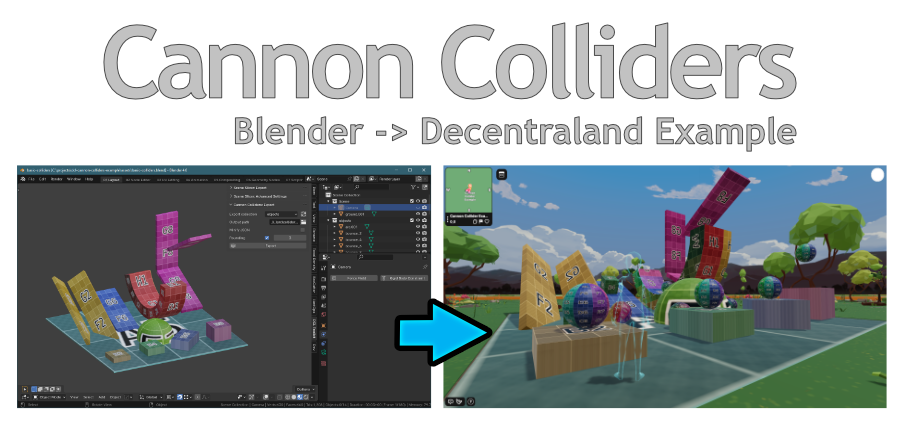

# DCL Cannon Colliders Test Scene

## Overview

This repository is an example Decentraland SDK7 scene with Cannon physics, with colliders loaded from JSON files generated by the Blender plugin  "Cannon Colliders".

It contains a test scene, sample JSON collider files, Blender files used to create them, as well as TypeScript examples.


### Blender plugin

You can download the Blender plugin here: [Decentraland Toolkit: Cannon Colliders](https://github.com/stom66/blender-dcltk-cannon-colliders/).

## Examples:

#### TypeScript
See [`func.collidersFromJSON.ts`](src/func.collidersFromJSON.ts) for the TypeScript example of loading the JSON and creating the different types of collider. The following collider types are supported: `BOX`, `SPHERE`, and `MESH`. 

### Blender
The blend files used to generate the collider JSON are also included. 

* [assets/basic-colliders.blend](assets/basic-colliders.blend) - a simple example of the basic supported shapes

* [assets/skate-park.blend](assets/skate-park.blend) - a low-poly skatepark which contains a number of more complex colliders. Note that `MESH` colliders are computationally expensive, so simpler `BOX` colliders are used where possible for optimisation


## Previewing the scene

1. Download this repository.

2. Open a Visual Studio Code window on this scene's root folder.

3. Open the Decentraland Editor tab, and press **Run Scene**

Alternatively, you can use the command line. Inside this scene root directory run:

```
npm run start
```

## Previewing the skatepark

WIP: be nice to add in the skateboard character movement from bences example, but might be beyond the scope of this demo repo